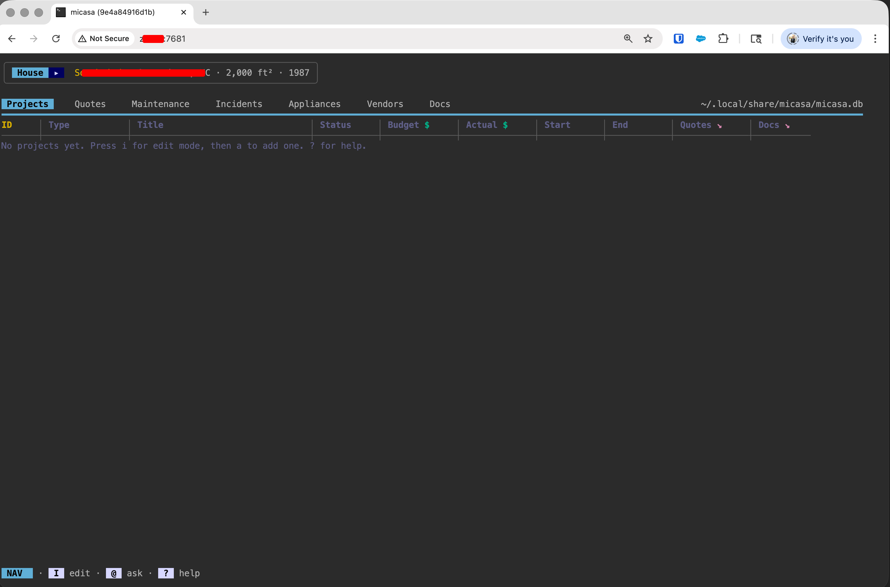

1. Build the image or pull it from this repo's releases

```podman build -t micasaweb .```

2. Work out local permissions for the volume mount

3. Run the container

```
podman run -d \
-p 7681:7681 \
-v /home/<somebody>/.local/share/micasa-data:/home/micasa/.local/share/micasa \
--name micasa \
localhost/micasaweb
```
4. Point your browser to ```http://<host>:7681```

5. Contribute to the project to make it better
